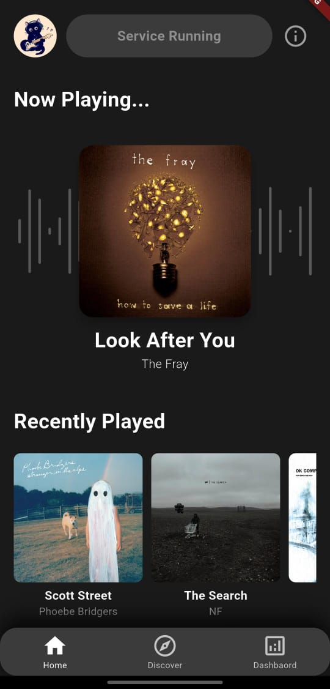
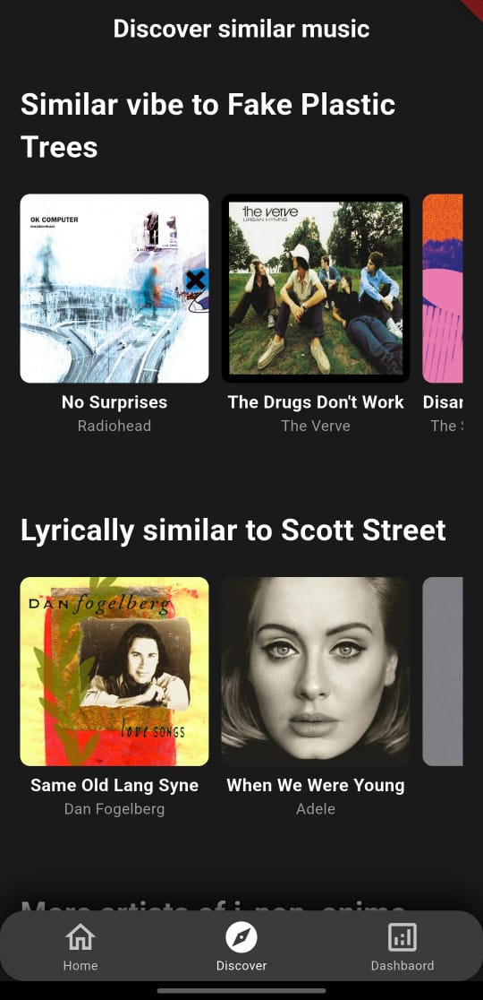
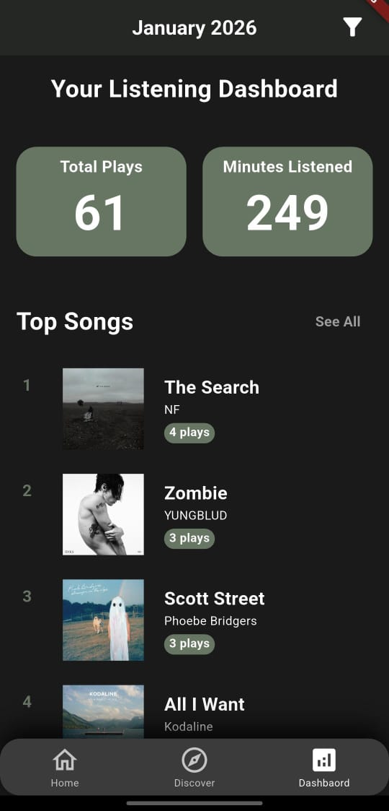

# Cue (Universal Scrobbler)


Free your music stats. A next-generation music discovery and tracking ecosystem that scrobbles from any Android music player—not just Spotify. Powered by Google Gemini for deep, context-aware recommendations.

## What is Cue?

Most scrobblers rely on the Spotify API, meaning they ignore your local files, YouTube Music streams, or SoundCloud deep cuts.

Cue is different. It lives on your phone, listening to your notification shade. If a song is playing on any allowed app, we track it, verify it against Spotify's database, and use it to feed a powerful AI recommendation engine.

## Key Features

### Universal Scrobbling
* **Works Everywhere:** Detects music from Spotify, YouTube Music, Soundcloud, Tidal, and even local players like Sony Walkman or Samsung Music.
* **Smart Detection:**
    * **Loop Filtering:** Consecutive plays of the same song are intelligently grouped.
    * **30-Second Rule:** Only logs songs listened to for at least 30 seconds.
    * **Spotify Verification:** Validates metadata against Spotify to ensure your database stays clean.

### Deep Statistics
* **Today at a Glance:** See what you've jammed to in the last 24 hours.
* **Interactive Dashboard:**
    * Filter stats by All Time, Specific Year, or Specific Month.
    * Track Total Plays & Minutes Listened.
    * View Top Songs & Top Artists for any selected period.

### AI-Powered Recommendations
Traditional algorithms use collaborative filtering ("People who liked X also liked Y"). Cue uses Content-Based AI analysis:

| Engine | Description |
| :--- | :--- |
| **Vibe Match** | Finds songs with the same emotional vibe and listening experience, based on human perception rather than musical labels. |
| **Lyrical Resonance** | Reads the lyrics (via Genius) and understands the narrative deep meaning to recommend songs with similar stories. |
| **Credit Hunter** | Uses MusicBrainz to find the producers and songwriters behind your hits and shows you what else they created. |
| **Artist Explorer** | Analyzes your genre mix to suggest artists you haven't heard yet but will love. |
| **Sample Detective** | Finds songs that sampled your favorites, or the originals that your favorites sampled. |

## Tech Stack

### Frontend (Mobile App)
* **Framework:** Flutter (Dart)
* **State Management:** setState & Provider patterns
* **Core Plugin:** flutter_notification_listener
* **UI/UX:** Custom "Sage Green" Dark Mode, Animated Audio Visualizers

### Backend (API)
* **Framework:** FastAPI (Python)
* **Database:** PostgreSQL (Hosted on Render) / SQLite (Dev) via SQLModel
* **Authentication:** JWT (JSON Web Tokens) with Email OTP Verification (Brevo/Resend)

### External APIs & Tools
* **Google Gemini 2.5 Flash:** For lyrical and vibe analysis.
* **Spotify Web API:** For metadata validation and cover art.
* **Genius API:** For fetching lyrics.
* **MusicBrainz:** For deep production credits.

## Installation & Setup

Want to run this yourself? Follow these steps.

<details>
<summary><b>1. Backend Setup (Python)</b></summary>

1.  **Clone the repository** and navigate to the backend folder:
    ```bash
    git clone [https://github.com/yourusername/cue.git](https://github.com/yourusername/cue.git)
    cd cue/backend
    ```

2.  **Create and activate a virtual environment:**
    ```bash
    python -m venv venv
    # Windows
    venv\Scripts\activate
    # Mac/Linux
    source venv/bin/activate
    ```

3.  **Install dependencies:**
    ```bash
    pip install -r requirements.txt
    ```

4.  **Configure Environment Variables:**
    Create a `.env` file in the backend directory and add the following keys:
    ```env
    DATABASE_URL=sqlite:///music.db  # Or your PostgreSQL URL
    JWT_SECRET_KEY=your_secret_key
    SPOTIPY_CLIENT_ID=your_spotify_id
    SPOTIPY_CLIENT_SECRET=your_spotify_secret
    GEMINI_API_KEY=your_gemini_key
    GENIUS_ACCESS_TOKEN=your_genius_token
    BREVO_API_KEY=your_email_api_key
    MAIL_USERNAME=your_email_address
    ```

5.  **Run the Server:**
    ```bash
    uvicorn main:app --reload
    ```
    The API will be available at `http://127.0.0.1:8000`.

</details>

<details>
<summary><b>2. Frontend Setup (Flutter)</b></summary>

1.  **Navigate to the app folder:**
    ```bash
    cd ../
    ```

2.  **Install dependencies:**
    ```bash
    flutter pub get
    ```

3.  **Configure Environment Variables:**
    Create a `.env` file in the root directory:
    ```env
    API_BASE_URL=[http://10.0.2.2:8000](http://10.0.2.2:8000)  # Use this for Android Emulator
    # OR use your local IP if running on a real device
    # API_BASE_URL=[http://192.168.](http://192.168.)x.x:8000
    ```

4.  **Run the App:**
    ```bash
    flutter run
    ```

</details>

## Screenshots

| Home & Visualizer | Recommendations | Analytics Dashboard |
|:---:|:---:|:---:|
|  |  |  |
| *Real-time detection with animated wave visualizer* | *Context-aware suggestions based on lyrics & vibes* | *Monthly & Yearly stats with detailed breakdowns* |


## License

Distributed under the MIT License. See LICENSE for more information.

Made with love by Maria
